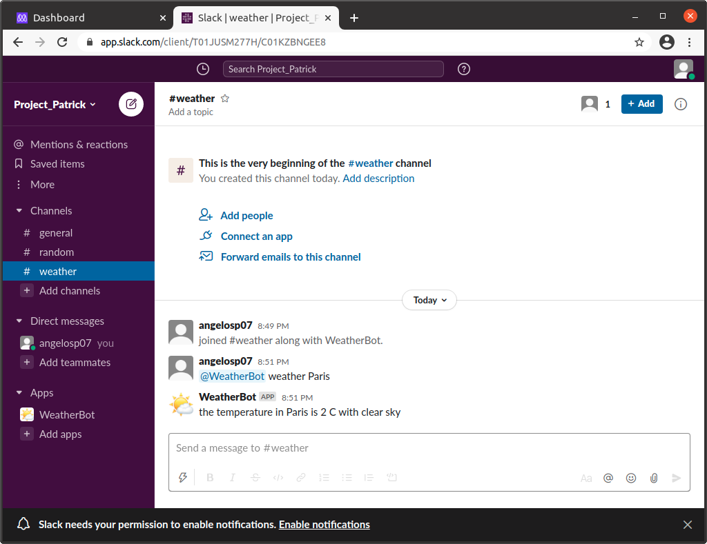

# SlackBot

A weather bot app for slack that report the weather in real time for any city.

## Built With

- Ruby

## Getting Started

To test the bot in your local environment you will have to follow the next steps

- You must have a slack account
- Make a new workspace
- Go to slack app directory and into Custom Integrations to make a Bot user for your workspace
  (You will take your API token from there)
- Add the bot to a channel
- The bot also uses the OpenWeatherMap API. To take a token for that, simply go to https://openweathermap.org/api
and subscribe for the Current Weather Data, make an account and take your token (note that the token might take a few minutes to activate)
- `git clone git@github.com:patrick-angelos/SlackBot.git`
- `cd SlackBot`
- Create a .env file on the root directory where you will store your tokens like so
- SLACK_API_TOKEN=xoxb-...
- WEATHER_TOKEN=1234...
- run `bundle install`
- run `ruby bin/main.rb`
- Your WeatherBot is ready to go

## Commands

To Bot accepts the following commands
- help: for a description of the commands
- hi: Replies with Hello
- weather "city": reports the weather in the specified city
- detailed "city": for a more detailed weather report in the specified city

Remember that the bot will reply only when taged.
For example `@WeatherBot weather Athens` will give you a weather report for Athens

## Author

👤 **Patrikis Angelos**

- GitHub: [@patrick-angelos](https://github.com/patrick-angelos)
- Twitter: [@AngelosPatrikis](https://twitter.com/AngelosPatrikis)
- LinkedIn: [Angelos Patrikis](https://www.linkedin.com/in/angelos-patrikis-a590a61b5/)

## 🤝 Contributing

Contributions, issues, and feature requests are welcome!

## Show your support

Give a ⭐️ if you like this project!

## Acknowledgments

- Hat tip to Microverse for their `README` template.

## 📝 License

MIT License